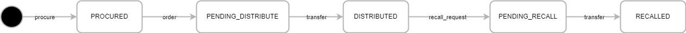

# Drug Trace
A blockchain-based system to trace distribution and recall transaction in the pharmaceutical supply chain. The code is based on Hyperledger Fabric's commercial-paper under fabric-sample repository (https://github.com/hyperledger/fabric-samples/tree/main/commercial-paper).

# Lifecycle

The state transition diagram for a drug batch. Drug batch transitions between ***procured***, ***pending_distribute***, ***distributed***, ***pending_recall***, and ***recalled*** states by means of ***procure***, ***order***, ***transfer***, and ***recall_request*** transactions.
